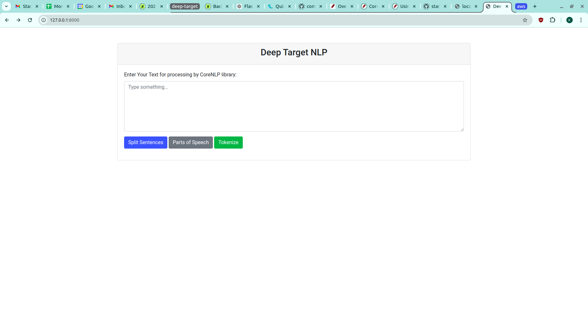
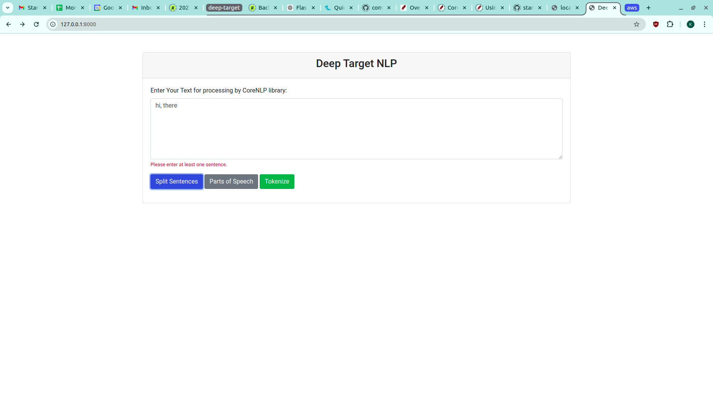
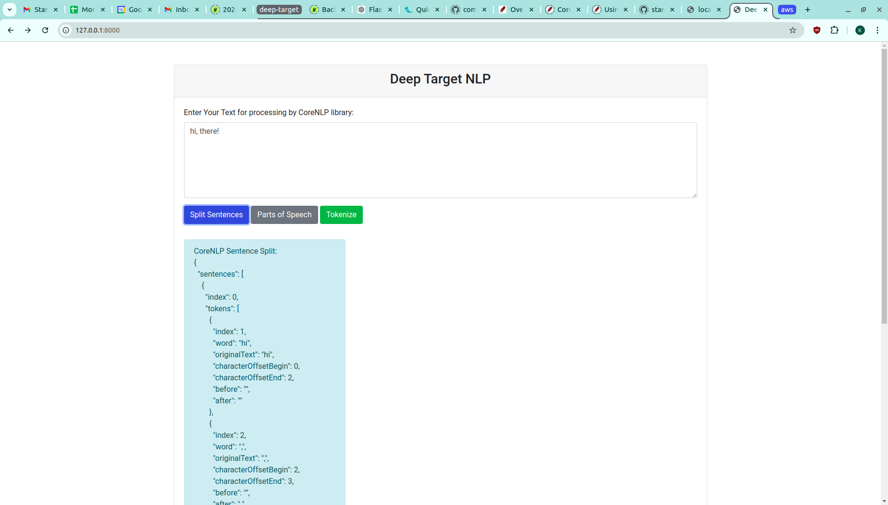
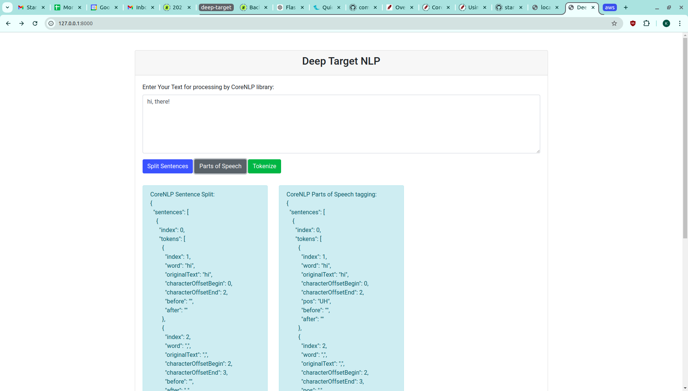
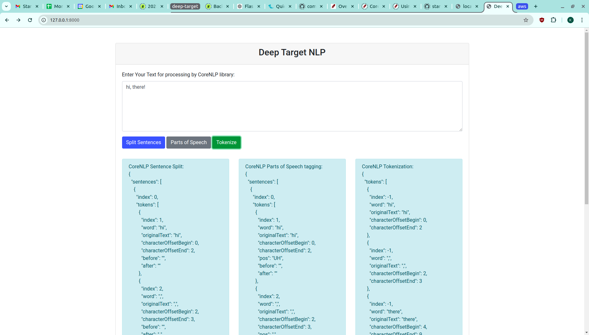
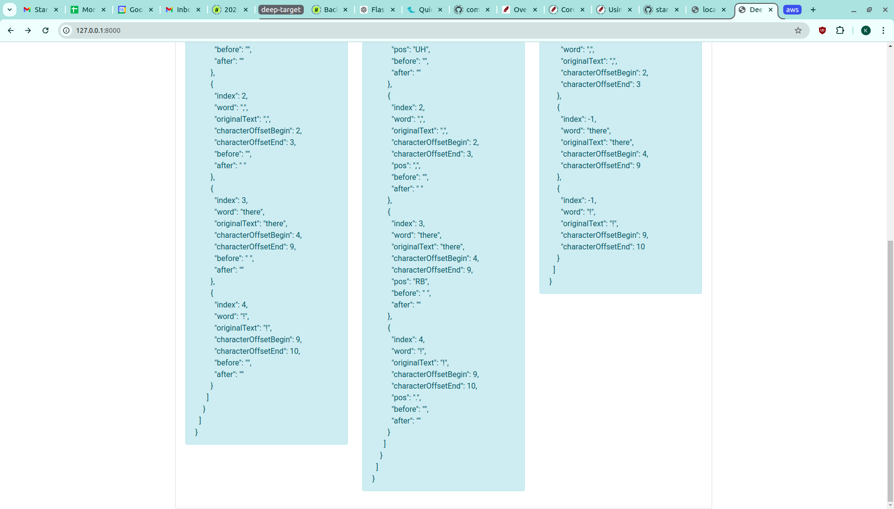

# Deep Target NLP

## Prerequisites
- python3
- docker engine
- docker compose

## Dev Build and Deploy

    $ make

## Stopping the application

    $ make clean

## CoreNLP
I am using the prebuilt docker image from https://hub.docker.com/r/nlpbox/corenlp.

Running CoreNLP as a separate web server and interacting from the flask app using the HTTP Web API of CoreNLP Server.

Docs: https://stanfordnlp.github.io/CoreNLP/corenlp-server.html

## Usage
Once the server is started, open a web browser and type the address appropriate for the server.

- If deploying on a local server, url: http://localhost:8000/
- If deploying in cloud, use the cloud VM's IP address with port 8000 after configuring the firewall. Url: `http://<vm_ip>:8000/`

## Sample working

Write some text with punctuation in the input field and click on any button to view the CoreNLP processed result.

### Landing page:

### Input Validation:
(The sentence is not complete)

### Sentence splitting:

### Parts of speech:

### Tokenize:

Full output:
